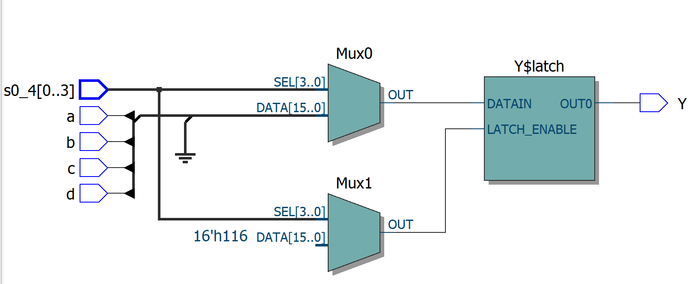

<!--
 * @Author: QianXu
 * @LastEditors: QianXu
 * @Description: NONE
 * @Date: 2019-03-05 16:32:45
 * @LastEditTime: 2019-03-05 16:57:09
 -->
# 四选一数据选择器

## 要求 
用if_then,when_else,case写四选一数据选择器。选通控制端有4个输入：S0、S1、S2、S3。当且仅当S0=0时:Y=A;  S1=1:Y=B;  S2=0:Y=C; S3=0,Y=D。

## RTL viewer
